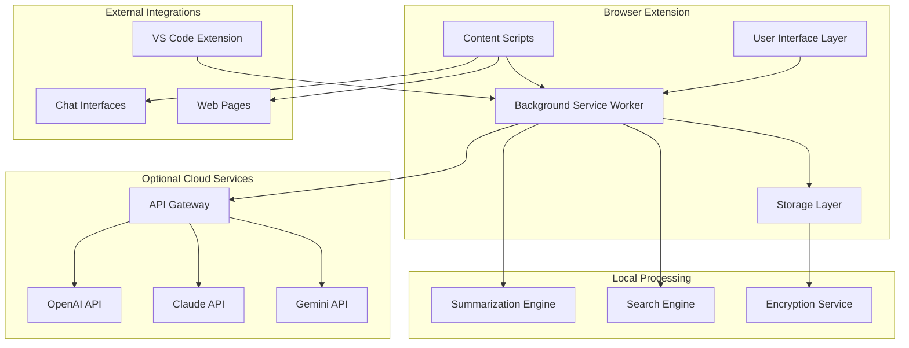

# Design Document

## Overview

Auto-Context-Engineer is designed as a privacy-first browser extension with optional IDE integration that automatically captures, summarizes, and manages LLM context to overcome token limitations. The architecture prioritizes local processing with optional cloud enhancement via user-provided API keys (BYOK). The system uses a modular, event-driven architecture that can operate entirely offline while providing seamless integration with popular development tools and chat interfaces.

## Architecture

### High-Level Architecture



### Core Components

1. **Background Service Worker**: Central orchestrator handling all extension logic
2. **Content Scripts**: Context capture from web pages and chat interfaces
3. **Storage Layer**: Encrypted local storage using IndexedDB
4. **Summarization Engine**: Local and cloud-based text processing
5. **User Interface**: Popup, options page, and dashboard components
6. **API Gateway**: Secure interface to cloud services using user keys

## Components and Interfaces

### Background Service Worker

**Purpose**: Central hub for all extension operations, message routing, and state management.

**Key Responsibilities**:
- Context aggregation and processing
- Storage operations coordination
- API request management
- Privacy policy enforcement
- Cross-tab communication

**Interface**:
```typescript
interface BackgroundService {
  // Context Management
  captureContext(source: ContextSource, data: ContextData): Promise<void>
  summarizeContext(contextId: string, options: SummarizationOptions): Promise<Summary>
  
  // Storage Operations
  storeContext(context: ProcessedContext): Promise<string>
  searchContexts(query: SearchQuery): Promise<SearchResult[]>
  
  // Cloud Integration
  cloudSummarize(content: string, provider: CloudProvider, apiKey: string): Promise<Summary>
  
  // Privacy Controls
  setPrivacyMode(mode: PrivacyMode): void
  auditLog(action: AuditAction): void
}
```

### Context Capture System

**Purpose**: Monitor and capture relevant context from various sources.

**Components**:
- **IDE Monitor**: Captures file changes, cursor position, active tabs
- **Chat Monitor**: Tracks conversation flow and token usage
- **Web Monitor**: Captures selected text and page context

**Interface**:
```typescript
interface ContextCapture {
  startMonitoring(source: ContextSource): void
  stopMonitoring(source: ContextSource): void
  getCurrentContext(source: ContextSource): ContextSnapshot
  
  // Event handlers
  onContextChange(callback: (context: ContextData) => void): void
  onTokenLimitApproach(callback: (usage: TokenUsage) => void): void
}

interface ContextData {
  id: string
  source: ContextSource
  timestamp: number
  content: string
  metadata: ContextMetadata
  tokenCount: number
}
```

### Summarization Engine

**Purpose**: Process and compress context using local and cloud-based algorithms.

**Local Algorithms**:
- TextRank for extractive summarization
- Keyword extraction using TF-IDF
- Sentence scoring and ranking

**Cloud Integration**:
- OpenAI GPT models
- Anthropic Claude
- Google Gemini

**Interface**:
```typescript
interface SummarizationEngine {
  // Local summarization
  summarizeLocal(content: string, options: LocalSummarizationOptions): Promise<Summary>
  
  // Cloud summarization
  summarizeCloud(content: string, provider: CloudProvider, apiKey: string): Promise<Summary>
  
  // Comparison and evaluation
  compareSummaries(summaries: Summary[]): SummaryComparison
  evaluateQuality(original: string, summary: Summary): QualityMetrics
}

interface Summary {
  id: string
  originalLength: number
  summaryLength: number
  compressionRatio: number
  content: string
  keywords: string[]
  algorithm: string
  timestamp: number
  quality: QualityScore
}
```

### Storage Layer

**Purpose**: Secure, encrypted local storage with efficient search capabilities.

**Storage Strategy**:
- IndexedDB for structured data
- Web Crypto API for encryption
- Compression for space efficiency
- Indexing for fast search

**Interface**:
```typescript
interface StorageLayer {
  // Core operations
  store(key: string, data: any): Promise<void>
  retrieve(key: string): Promise<any>
  delete(key: string): Promise<void>
  
  // Search operations
  search(query: SearchQuery): Promise<SearchResult[]>
  index(data: IndexableData): Promise<void>
  
  // Encryption
  encrypt(data: any): Promise<EncryptedData>
  decrypt(encryptedData: EncryptedData): Promise<any>
  
  // Maintenance
  cleanup(criteria: CleanupCriteria): Promise<void>
  getUsageStats(): Promise<StorageStats>
}
```

### User Interface Components

**Dashboard Component**:
- Real-time usage statistics
- Recent context sessions
- Quick search interface
- Storage management tools

**Settings Component**:
- Privacy controls
- API key management
- Summarization preferences
- Performance tuning

**Search Component**:
- Full-text search
- Filter and sort options
- Context preview
- Export capabilities

## Data Models

### Context Model

```typescript
interface Context {
  id: string
  source: ContextSource
  timestamp: number
  content: string
  summary?: Summary
  metadata: {
    tokenCount: number
    language?: string
    fileType?: string
    chatPlatform?: string
    tags: string[]
  }
  encryption: {
    algorithm: string
    keyId: string
    iv: string
  }
}
```

### User Preferences Model

```typescript
interface UserPreferences {
  privacy: {
    localOnly: boolean
    cloudOptIn: boolean
    auditLogging: boolean
  }
  summarization: {
    localAlgorithm: LocalAlgorithm
    compressionTarget: number
    qualityThreshold: number
    autoSummarize: boolean
  }
  cloud: {
    providers: CloudProviderConfig[]
    costLimits: CostLimits
    fallbackBehavior: FallbackBehavior
  }
  ui: {
    theme: Theme
    dashboardLayout: DashboardLayout
    notifications: NotificationSettings
  }
}
```

### Search Index Model

```typescript
interface SearchIndex {
  contextId: string
  content: string
  keywords: string[]
  timestamp: number
  source: ContextSource
  tags: string[]
  summary: string
  // Full-text search fields
  searchableText: string
  // Metadata for filtering
  metadata: SearchMetadata
}
```

## Error Handling

### Error Categories

1. **Storage Errors**: IndexedDB failures, encryption issues, quota exceeded
2. **Network Errors**: API failures, connectivity issues, rate limiting
3. **Processing Errors**: Summarization failures, parsing errors
4. **Permission Errors**: Browser permission denied, API key invalid
5. **Privacy Errors**: Unauthorized data access attempts

### Error Handling Strategy

```typescript
interface ErrorHandler {
  handleStorageError(error: StorageError): Promise<void>
  handleNetworkError(error: NetworkError): Promise<void>
  handleProcessingError(error: ProcessingError): Promise<void>
  
  // Fallback mechanisms
  fallbackToLocal(operation: CloudOperation): Promise<any>
  gracefulDegradation(feature: Feature): void
  
  // User notification
  notifyUser(error: UserFacingError): void
  logError(error: Error, context: ErrorContext): void
}
```

### Fallback Mechanisms

1. **Cloud to Local**: When cloud APIs fail, fall back to local summarization
2. **Storage Fallback**: Use memory storage if IndexedDB fails
3. **Feature Degradation**: Disable non-essential features if core functionality fails
4. **Offline Mode**: Full functionality without network connectivity

## Testing Strategy

### Unit Testing

- **Storage Layer**: Test encryption, compression, and CRUD operations
- **Summarization Engine**: Test local algorithms and cloud integration
- **Context Capture**: Test monitoring and data extraction
- **Privacy Controls**: Test data isolation and audit logging

### Integration Testing

- **Cross-Component**: Test message passing between components
- **Browser Compatibility**: Test across Chrome, Firefox, Edge
- **API Integration**: Test with actual cloud provider APIs
- **Performance**: Test with large datasets and concurrent operations

### End-to-End Testing

- **User Workflows**: Test complete user journeys
- **Privacy Scenarios**: Test data handling in various privacy modes
- **Error Scenarios**: Test error handling and recovery
- **Security Testing**: Test encryption and data protection

### Testing Framework

```typescript
interface TestSuite {
  // Unit tests
  testStorageOperations(): Promise<TestResult>
  testSummarizationAlgorithms(): Promise<TestResult>
  testEncryption(): Promise<TestResult>
  
  // Integration tests
  testCrossComponentCommunication(): Promise<TestResult>
  testCloudAPIIntegration(): Promise<TestResult>
  testBrowserCompatibility(): Promise<TestResult>
  
  // E2E tests
  testCompleteUserWorkflow(): Promise<TestResult>
  testPrivacyCompliance(): Promise<TestResult>
  testErrorRecovery(): Promise<TestResult>
}
```

### Performance Requirements

- **Context Capture**: < 100ms latency for real-time monitoring
- **Local Summarization**: < 5 seconds for 10,000 tokens
- **Search Operations**: < 1 second for full-text search
- **Storage Operations**: < 500ms for typical read/write operations
- **Memory Usage**: < 50MB for background processes

### Security Considerations

1. **Data Encryption**: AES-256 for all stored data
2. **Key Management**: Secure key derivation and storage
3. **API Security**: Secure handling of user-provided API keys
4. **Content Security**: CSP headers and secure communication
5. **Privacy Protection**: No data transmission without explicit consent

### Scalability Design

- **Storage Scaling**: Automatic cleanup and archival of old data
- **Processing Scaling**: Queue-based processing for large operations
- **Memory Management**: Efficient garbage collection and resource cleanup
- **Performance Monitoring**: Built-in metrics and optimization suggestions