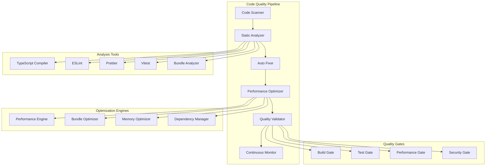

# Design Document

## Overview

The Code Quality Optimization system is designed as a comprehensive, automated solution for identifying, fixing, and preventing code quality issues across the entire auto-context-engineer codebase. The system employs a multi-layered approach combining static analysis, automated fixes, performance optimization, and continuous monitoring to achieve and maintain production-ready code quality standards.

## Architecture

### High-Level Architecture



### Core Components

1. **Code Quality Pipeline**: Orchestrates the entire optimization process
2. **Static Analysis Engine**: Identifies issues using multiple tools
3. **Automated Fix Engine**: Applies fixes automatically where safe
4. **Performance Optimization Engine**: Optimizes runtime and build performance
5. **Quality Validation System**: Ensures fixes don't introduce regressions
6. **Continuous Monitoring**: Tracks quality metrics over time

## Components and Interfaces

### Code Quality Pipeline

**Purpose**: Central orchestrator that manages the entire code quality optimization workflow.

**Key Responsibilities**:
- Coordinate analysis tools execution
- Manage fix application order
- Validate changes before committing
- Generate comprehensive reports
- Handle rollback scenarios

**Interface**:
```typescript
interface CodeQualityPipeline {
  // Main execution
  runFullOptimization(options: OptimizationOptions): Promise<OptimizationResult>
  runIncrementalOptimization(changedFiles: string[]): Promise<OptimizationResult>
  
  // Individual phases
  scanCodebase(): Promise<ScanResult>
  analyzeIssues(scanResult: ScanResult): Promise<AnalysisResult>
  applyFixes(issues: Issue[]): Promise<FixResult>
  optimizePerformance(): Promise<PerformanceResult>
  validateChanges(): Promise<ValidationResult>
  
  // Monitoring
  generateReport(): Promise<QualityReport>
  trackMetrics(): Promise<QualityMetrics>
}

interface OptimizationOptions {
  scope: 'full' | 'incremental' | 'targeted'
  categories: QualityCategory[]
  autoFix: boolean
  performanceOptimization: boolean
  generateReport: boolean
  dryRun: boolean
}
```

### Static Analysis Engine

**Purpose**: Comprehensive code analysis using multiple tools and custom rules.

**Analysis Categories**:
- **TypeScript Errors**: Compilation errors, type mismatches, strict mode violations
- **ESLint Issues**: Code style, best practices, potential bugs
- **Performance Issues**: Inefficient patterns, memory leaks, blocking operations
- **Security Vulnerabilities**: Dependency vulnerabilities, unsafe patterns
- **Accessibility Issues**: Missing ARIA labels, keyboard navigation problems

**Interface**:
```typescript
interface StaticAnalysisEngine {
  // Core analysis
  analyzeTypeScript(files: string[]): Promise<TypeScriptIssue[]>
  analyzeESLint(files: string[]): Promise<ESLintIssue[]>
  analyzePerformance(files: string[]): Promise<PerformanceIssue[]>
  analyzeSecurity(files: string[]): Promise<SecurityIssue[]>
  analyzeAccessibility(files: string[]): Promise<AccessibilityIssue[]>
  
  // Dependency analysis
  analyzeDependencies(): Promise<DependencyIssue[]>
  checkVulnerabilities(): Promise<VulnerabilityReport>
  findUnusedDependencies(): Promise<string[]>
  
  // Custom rules
  applyCustomRules(files: string[], rules: CustomRule[]): Promise<CustomIssue[]>
}

interface Issue {
  id: string
  type: IssueType
  severity: 'error' | 'warning' | 'info'
  file: string
  line: number
  column: number
  message: string
  rule: string
  fixable: boolean
  autoFixable: boolean
  category: QualityCategory
}
```

### Automated Fix Engine

**Purpose**: Safely apply automated fixes for identified issues.

**Fix Categories**:
- **Safe Fixes**: Formatting, import organization, simple type fixes
- **Semi-Safe Fixes**: Require validation but low risk
- **Manual Fixes**: Require human review and intervention

**Interface**:
```typescript
interface AutomatedFixEngine {
  // Fix application
  applyFixes(issues: Issue[], options: FixOptions): Promise<FixResult>
  applySafeFixes(issues: Issue[]): Promise<FixResult>
  generateFixSuggestions(issues: Issue[]): Promise<FixSuggestion[]>
  
  // Fix validation
  validateFix(fix: Fix): Promise<ValidationResult>
  testFix(fix: Fix): Promise<TestResult>
  rollbackFix(fixId: string): Promise<void>
  
  // Fix strategies
  fixTypeScriptErrors(issues: TypeScriptIssue[]): Promise<FixResult>
  fixESLintIssues(issues: ESLintIssue[]): Promise<FixResult>
  fixPerformanceIssues(issues: PerformanceIssue[]): Promise<FixResult>
  optimizeImports(files: string[]): Promise<FixResult>
}

interface Fix {
  id: string
  issueId: string
  type: FixType
  description: string
  changes: FileChange[]
  riskLevel: 'safe' | 'semi-safe' | 'risky'
  testRequired: boolean
  rollbackData: RollbackData
}
```

### Performance Optimization Engine

**Purpose**: Optimize runtime performance, bundle size, and memory usage.

**Optimization Areas**:
- **Bundle Optimization**: Code splitting, tree shaking, compression
- **Runtime Performance**: Lazy loading, memoization, debouncing
- **Memory Optimization**: Object pooling, cleanup, efficient data structures
- **Build Performance**: Parallel processing, caching, incremental builds

**Interface**:
```typescript
interface PerformanceOptimizationEngine {
  // Bundle optimization
  optimizeBundle(): Promise<BundleOptimizationResult>
  analyzeBundleSize(): Promise<BundleAnalysis>
  implementCodeSplitting(): Promise<CodeSplittingResult>
  optimizeAssets(): Promise<AssetOptimizationResult>
  
  // Runtime optimization
  optimizeComponents(components: string[]): Promise<ComponentOptimizationResult>
  implementLazyLoading(modules: string[]): Promise<LazyLoadingResult>
  optimizeEventHandlers(files: string[]): Promise<EventOptimizationResult>
  
  // Memory optimization
  optimizeMemoryUsage(files: string[]): Promise<MemoryOptimizationResult>
  implementObjectPooling(classes: string[]): Promise<PoolingResult>
  optimizeDataStructures(files: string[]): Promise<DataStructureResult>
  
  // Build optimization
  optimizeBuildProcess(): Promise<BuildOptimizationResult>
  implementCaching(): Promise<CachingResult>
  parallelizeBuilds(): Promise<ParallelizationResult>
}

interface PerformanceMetrics {
  bundleSize: BundleSizeMetrics
  loadTime: LoadTimeMetrics
  memoryUsage: MemoryUsageMetrics
  renderPerformance: RenderMetrics
  buildTime: BuildTimeMetrics
}
```

### Quality Validation System

**Purpose**: Ensure all changes maintain or improve code quality without introducing regressions.

**Validation Gates**:
- **Build Gate**: Compilation success, no build errors
- **Test Gate**: All tests pass, coverage maintained
- **Performance Gate**: Performance metrics within acceptable ranges
- **Security Gate**: No new vulnerabilities introduced

**Interface**:
```typescript
interface QualityValidationSystem {
  // Validation gates
  validateBuild(): Promise<BuildValidationResult>
  validateTests(): Promise<TestValidationResult>
  validatePerformance(baseline: PerformanceMetrics): Promise<PerformanceValidationResult>
  validateSecurity(): Promise<SecurityValidationResult>
  
  // Comprehensive validation
  runAllValidations(): Promise<ValidationSummary>
  validateChanges(changes: FileChange[]): Promise<ChangeValidationResult>
  
  // Regression detection
  detectRegressions(before: QualityMetrics, after: QualityMetrics): Promise<RegressionReport>
  validateAgainstBaseline(baseline: QualityBaseline): Promise<BaselineValidationResult>
}

interface ValidationResult {
  passed: boolean
  score: number
  issues: ValidationIssue[]
  metrics: QualityMetrics
  recommendations: string[]
  blockers: string[]
}
```

## Data Models

### Quality Metrics Model

```typescript
interface QualityMetrics {
  timestamp: number
  codebase: {
    totalFiles: number
    totalLines: number
    testCoverage: number
    duplicateCodePercentage: number
    complexityScore: number
  }
  errors: {
    typeScriptErrors: number
    eslintErrors: number
    testFailures: number
    buildErrors: number
  }
  warnings: {
    typeScriptWarnings: number
    eslintWarnings: number
    deprecationWarnings: number
    performanceWarnings: number
  }
  performance: {
    bundleSize: number
    loadTime: number
    memoryUsage: number
    buildTime: number
  }
  security: {
    vulnerabilities: VulnerabilityCount
    securityScore: number
  }
  maintainability: {
    technicalDebt: number
    codeSmells: number
    maintainabilityIndex: number
  }
}
```

### Optimization Configuration Model

```typescript
interface OptimizationConfig {
  analysis: {
    enabledTools: AnalysisTool[]
    customRules: CustomRule[]
    excludePatterns: string[]
    severity: SeverityConfig
  }
  fixes: {
    autoFixEnabled: boolean
    safeFixesOnly: boolean
    fixCategories: FixCategory[]
    requireApproval: boolean
  }
  performance: {
    bundleOptimization: BundleOptimizationConfig
    runtimeOptimization: RuntimeOptimizationConfig
    memoryOptimization: MemoryOptimizationConfig
  }
  validation: {
    requiredGates: ValidationGate[]
    performanceThresholds: PerformanceThresholds
    testCoverageThreshold: number
    qualityGateThreshold: number
  }
  reporting: {
    generateReports: boolean
    reportFormats: ReportFormat[]
    includeMetrics: boolean
    historicalComparison: boolean
  }
}
```

### Fix Strategy Model

```typescript
interface FixStrategy {
  id: string
  name: string
  description: string
  applicableIssues: IssueType[]
  riskLevel: RiskLevel
  automationLevel: AutomationLevel
  prerequisites: string[]
  implementation: FixImplementation
  validation: FixValidation
  rollback: RollbackStrategy
}

interface FixImplementation {
  type: 'ast-transform' | 'text-replace' | 'file-operation' | 'command'
  parameters: Record<string, any>
  beforeHooks: Hook[]
  afterHooks: Hook[]
}
```

## Error Handling

### Error Categories

1. **Analysis Errors**: Tool failures, parsing errors, configuration issues
2. **Fix Application Errors**: Failed transformations, file system errors
3. **Validation Errors**: Test failures, build errors, performance regressions
4. **System Errors**: Memory issues, timeout errors, dependency conflicts

### Error Handling Strategy

```typescript
interface QualityErrorHandler {
  handleAnalysisError(error: AnalysisError): Promise<void>
  handleFixError(error: FixError): Promise<void>
  handleValidationError(error: ValidationError): Promise<void>
  
  // Recovery strategies
  retryWithFallback(operation: Operation): Promise<any>
  rollbackChanges(changeSet: ChangeSet): Promise<void>
  skipProblematicFiles(files: string[]): Promise<void>
  
  // Error reporting
  reportError(error: QualityError): Promise<void>
  generateErrorReport(): Promise<ErrorReport>
}
```

### Rollback Mechanisms

1. **Git-based Rollback**: Use Git to revert changes
2. **Backup-based Rollback**: Restore from file backups
3. **Incremental Rollback**: Undo specific changes only
4. **Safe Mode**: Disable optimizations and run in safe mode

## Testing Strategy

### Testing Levels

1. **Unit Testing**: Individual components and utilities
2. **Integration Testing**: Tool integration and pipeline flow
3. **End-to-End Testing**: Complete optimization workflows
4. **Performance Testing**: Optimization effectiveness validation
5. **Regression Testing**: Ensure no quality degradation

### Test Categories

```typescript
interface QualityTestSuite {
  // Unit tests
  testAnalysisEngine(): Promise<TestResult>
  testFixEngine(): Promise<TestResult>
  testOptimizationEngine(): Promise<TestResult>
  testValidationSystem(): Promise<TestResult>
  
  // Integration tests
  testPipelineFlow(): Promise<TestResult>
  testToolIntegration(): Promise<TestResult>
  testErrorHandling(): Promise<TestResult>
  
  // E2E tests
  testFullOptimization(): Promise<TestResult>
  testIncrementalOptimization(): Promise<TestResult>
  testRollbackScenarios(): Promise<TestResult>
  
  // Performance tests
  testOptimizationEffectiveness(): Promise<TestResult>
  testPerformanceImpact(): Promise<TestResult>
  testScalability(): Promise<TestResult>
}
```

### Quality Gates

- **Pre-commit**: Basic linting and formatting
- **Pre-push**: Full test suite and basic analysis
- **CI Pipeline**: Complete optimization and validation
- **Release**: Comprehensive quality assessment

## Implementation Phases

### Phase 1: Foundation (Analysis & Detection)
- Set up analysis tools and configuration
- Implement issue detection and categorization
- Create reporting infrastructure
- Establish quality baselines

### Phase 2: Automated Fixes (Safe Fixes)
- Implement safe fix strategies
- Add fix validation and testing
- Create rollback mechanisms
- Build fix approval workflows

### Phase 3: Performance Optimization
- Implement bundle optimization
- Add runtime performance improvements
- Optimize memory usage patterns
- Enhance build performance

### Phase 4: Advanced Features
- Add custom rule support
- Implement machine learning for issue prediction
- Create advanced reporting and analytics
- Build continuous monitoring system

### Phase 5: Integration & Monitoring
- Integrate with CI/CD pipelines
- Set up continuous quality monitoring
- Create quality dashboards
- Implement alerting and notifications

## Success Metrics

### Quality Metrics
- **Error Reduction**: 100% elimination of compilation errors
- **Warning Reduction**: 95% reduction in linter warnings
- **Test Coverage**: Maintain 90%+ coverage
- **Code Quality Score**: Achieve 95+ quality score

### Performance Metrics
- **Bundle Size**: 30-50% reduction
- **Load Time**: 40-60% improvement
- **Memory Usage**: 25-40% reduction
- **Build Time**: 20-30% improvement

### Maintainability Metrics
- **Technical Debt**: 50% reduction
- **Code Duplication**: <5% duplication
- **Complexity**: Average complexity <10
- **Documentation**: 100% API documentation coverage